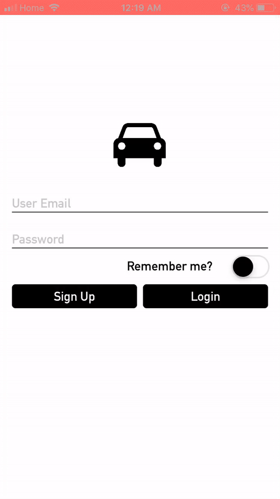
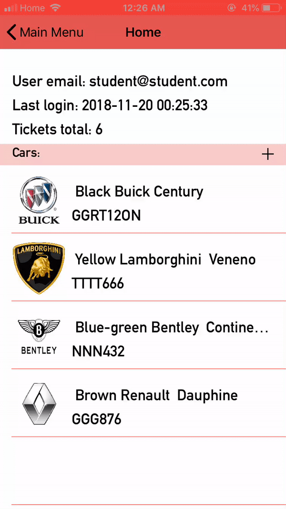
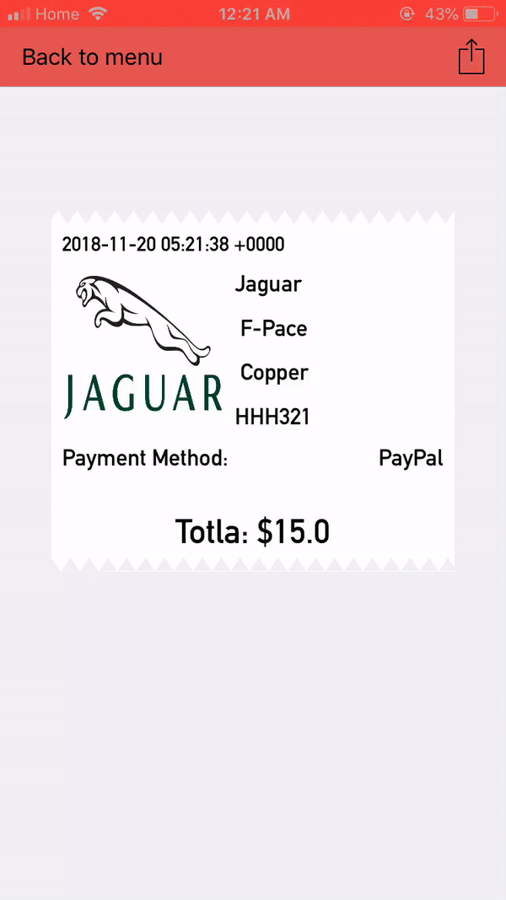
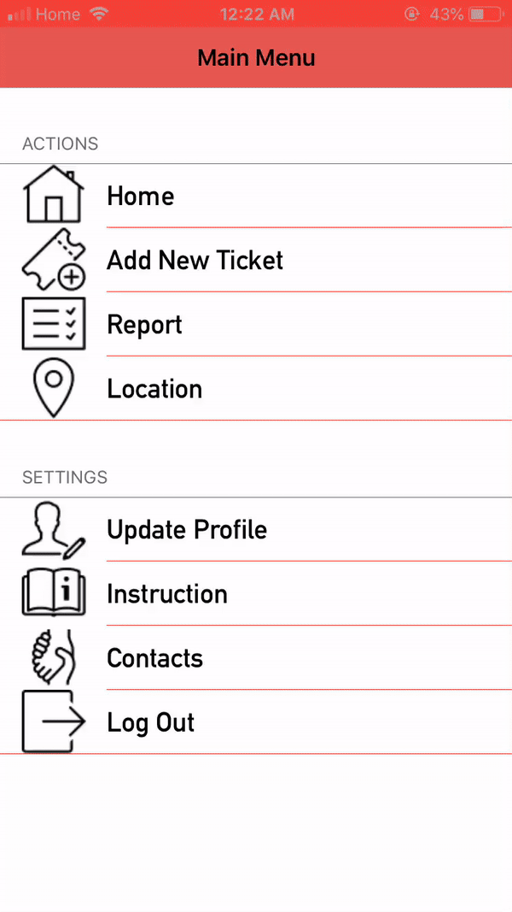
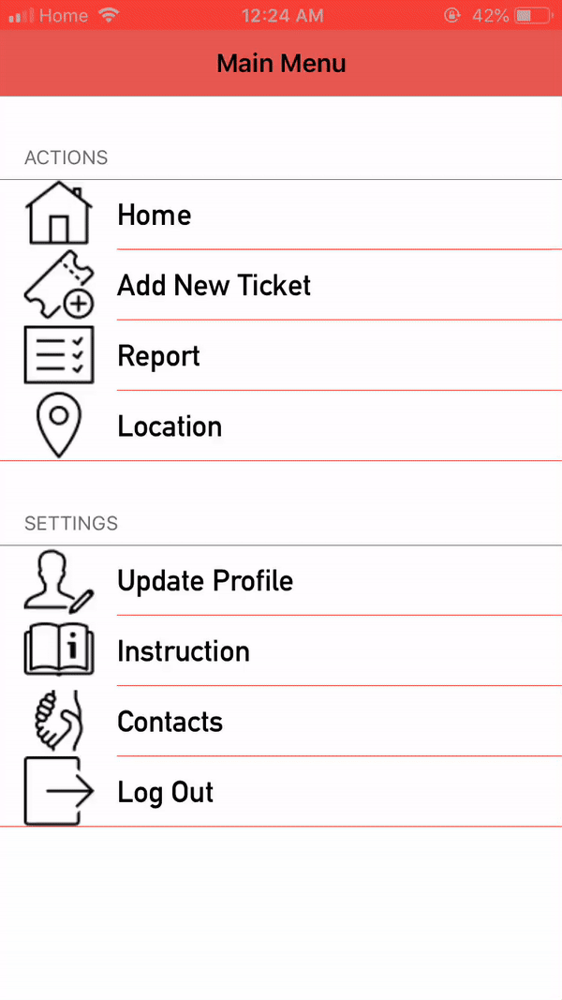

## ParkYourCar
Originally, this application was made as final assessment for iOS fundumental course in Lambton College. 
However, I decide to impove it in order to make it as demo application and to learn new technologies.

The concept is to provide user opportunity to create parking tickets with price calculation. After creation all tickets are stored and can be represented in any time. User also can generate PDF-file from parking receipt.
All user's data is stored in the cloud database(Firebase Realtime Database).

## To open the project

Once we have all dependencies installed, we need to open the project through the "Parking Space Booking System.xcworkspace" file, and not through "Parking Space Booking System.xcodeproj" anymore

## Pod install

On Terminal, inside the folder FinalProject, where we have the "Parking Space Booking System.xcodeproj", "Parking Space Booking System.xcworkspace", Podfile etc, run this line:

> pod install

---> It will create a folder called Pods in the folder of your project instance. and store parking tickets

## Dependencies

- [Firebase Project](https://firebase.google.com) - cloud database solution for mobile and web applications
- [KeychainAccess](https://github.com/kishikawakatsumi/KeychainAccess) - Swift keychain wrapper
- [SkyFloatingLabelTextField](https://github.com/Skyscanner/SkyFloatingLabelTextField) - Framework for designing TextFields
- [IQKeyboardManager](https://github.com/hackiftekhar/IQKeyboardManager) -  prevent issues of keyboard sliding up and cover UITextField/UITextView
- [AnimatedSwitch](https://github.com/alsedi/AnimatedSwitch) - animated UISwitch

## Screens
- SignUp

This screen is for registration of new users. User profile is created by Firebase Auth, all user details are saved in Firebase Realtime Database.
There are also email and password validation and alert view appearing when any fields remain empty.

- Login

After creation of account user is able to login in the application. On this screen there is authentication by Firebase/Auth.
There is also option to remember user email and password by toggling rememberMe switch. On this screen also login date are saved in keychain.

- Home

This is a home page for user. Here user can find information about lastlogin, numbers of created ticked and the list of saved cars.
Cars from this screen can also be added or deleted. All data comes from cloud.

- Add New Ticket

This screen is for main functionality. User should fill all fields and pick car(or add new car) to get parking receipt. All car brand logos comes from Firebase Storage.
Total amount changes dynamicaly by picking timming.

- Parking Receipt

This screen appear to user after taping on "Get reciept" button or from taping on ticket from Report Screen. There is a ticket summary here.
User can also generate pdf from ticket or share ticket in PDF format. PDF generates from HTML-template.

- Report

There is a summary of all created tickets by user coming from Firebase. Tickets can be filtered by car plate.

- Update User Profile

On this screen user can update details or update password. All data synchronizes with Firebase.

- Location

Current locaton of the user.

- Instruction

There is the example of parking instruction from [JustPark](https://www.justpark.com/about/how-it-works/).

- Contacts

By tapping on this button user can contact with support by phone, by SMS or by email.(in this examples all contact information is fake)

